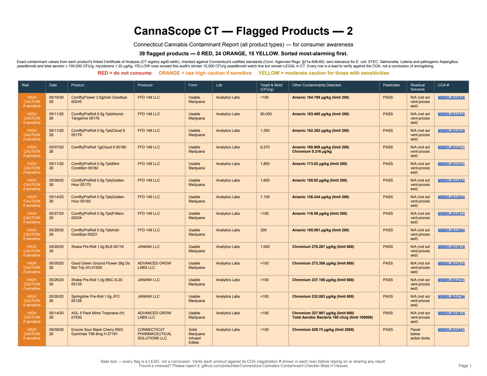

# CannaScope CT


**CannaScope CT** pulls Connecticut's public **Medical Marijuana & Adult-Use
Cannabis Product Registry** (dataset `egd5-wb6r`), opens **every** product's
linked Certificate of Analysis (COA), extracts the full contaminant panel, and
produces a color-coded, severity-sorted report flagging products for consumer
awareness — with a **clickable link to each source COA** so anyone can verify.

> **Every flag is a lead to verify against the source COA, not a conclusion of
> wrongdoing.** Each row shows the product's COA number as a clickable link to
> the official COA. Please read [`DISCLAIMER.md`](DISCLAIMER.md).



> ℹ️ **Versions.** This repo's current version is **CannaScope CT — V2**
> (`cannascope_ct_v2.py`). The original **Beta V1** is still available, unchanged,
> on the [Releases](../../releases) page and as
> `connecticut_cannabis_contaminant_checker_beta_v1.py` in this repo.

---

## Download (no coding required)

Grab the file for your operating system from the
[**Releases**](../../releases/latest) page, unzip it, and run the launcher:

| Your computer | Download | Then |
|---|---|---|
| **Windows** | `CannaScope-CT-V2-windows.zip` | unzip → double-click `Run CannaScope CT.bat` |
| **macOS** | `CannaScope-CT-V2-macos.zip` | unzip → right-click `Run CannaScope CT.command` → **Open** |
| **Linux** | `CannaScope-CT-V2-linux.zip` | unzip → `./run.sh` |

The launcher sets up everything on first run. You still need **Python 3.9+**
installed (the launcher links you to the download if it's missing) and an
internet connection.

> **macOS "can't be opened" / Windows "protected your PC"?** That's the OS
> blocking a downloaded script — normal, nothing is wrong. On macOS: right-click
> the launcher → **Open** → **Open** (or run `xattr -cr` on the unzipped folder
> in Terminal). On Windows: **More info → Run anyway**.

## What the colors mean

| | |
|---|---|
| 🟥 **RED** | **Do not consume** |
| 🟧 **ORANGE** | **Use high caution if sensitive** |
| 🟨 **YELLOW** | **Moderate caution for those with sensitivities** |

Under the hood, against Connecticut's codified standards (Conn. Agencies Regs.
§21a-408-60): **RED** = a forbidden contaminant detected (zero-tolerance
pathogens *E. coli*, STEC, *Salmonella*, *Listeria*, pathogenic *Aspergillus*) or
anything over a legal limit (yeast&mold/total aerobic > 100,000 CFU/g, a
mycotoxin ≥ 20 µg/kg, a failed pesticide or solvent panel). **ORANGE** = a heavy
metal or mycotoxin detected but within its legal limit. **YELLOW** = yeast & mold
over this tool's stricter 10,000 CFU/g watch line (still legal in CT), or a
residual solvent detected within limit.

---

## What's new in V2

- **All product types** — evaluates everything on the registry (flower, vapes,
  concentrates, edibles, tinctures, topicals), not just inhalables.
- **Reads scanned/image-only COAs** via built-in OCR (Apple Vision on macOS, or
  tesseract elsewhere) — they're evaluated instead of skipped.
- **Much faster** — PDF text via pypdfium2 (~65× faster than before), concurrent
  downloads, and a self-pruning cache. A typical run is a couple of minutes; a
  rerun is seconds.
- **Severity-sorted report** — most severe first (RED → ORANGE → YELLOW), and by
  contaminant magnitude within each tier.
- **Clickable COA links** — every COA number opens its exact source COA PDF.
- **Numbered reports** — each run writes a new `CannaScope CT - Flagged Products
  - N.pdf`, never overwriting the last.
- **Self-cleaning cache** — only flagged COAs are kept; everything else is
  removed automatically so the folder never fills up.

## How it works

Everything it reports comes from **public data** — Connecticut's product registry
and the lab COAs it links to:

1. **Download the registry** (dataset `egd5-wb6r`) and cache it locally.
2. **Pick the products** in your window (default: **all product types, last 30
   days**).
3. **Fetch each COA** PDF from the state portal (a browser-like session opens the
   gated portal).
4. **Read the PDF** with pypdfium2; if it's a scanned image, **OCR** reads it.
   Truly unreadable COAs are listed for manual review — never silently dropped.
5. **Parse each analyte by its label** (e.g. "Arsenic", "Total Yeast & Mold"),
   reading the result against the **COA's own limit column in the COA's own
   units** — which avoids unit-conversion mistakes (e.g. µg/kg vs µg/g).
6. **Apply the rules** → RED / ORANGE / YELLOW (see above).
7. **Write a numbered, severity-sorted report** with clickable COA links, and
   keep only the flagged COA PDFs.

It is deliberately conservative: when a value can't be read with confidence, the
COA goes to manual review rather than being guessed.

---

## ⚠️ Always cross-check against the actual COA — and report errors

**Treat every flag as a starting point, not a verdict.** COA PDFs come in many
lab-specific layouts and are parsed automatically; mistakes happen.

- **Verify before relying on anything.** Click the **COA number** in any row (or
  look it up on the state portal), open the COA, and confirm with your own eyes.
- **A flag is a lead, not proof** — nothing about any lab's or producer's conduct.
- **Found a misread? Please report it** — the most helpful thing you can do. Open
  an [**issue**](../../issues/new?template=coa_parsing_issue.md) with the COA
  number, what the tool said, and what the COA actually says. See
  [`CONTRIBUTING.md`](CONTRIBUTING.md).

Full terms in [`DISCLAIMER.md`](DISCLAIMER.md).

---

## Run from source

```bash
git clone https://github.com/jmlschlee/Connecticut-Cannabis-Contaminant-Checker-Beta-V1.git
cd Connecticut-Cannabis-Contaminant-Checker-Beta-V1

python3 -m venv venv
source venv/bin/activate            # Windows: venv\Scripts\activate
pip install -r requirements.txt

python cannascope_ct_v2.py          # last 30 days, all product types
```

Outputs land in **`./CannaScope CT - Flagged Product Results and Sources/`**:

| Item | What it is |
|------|------------|
| `CannaScope CT - Flagged Products - N.pdf` | the report (a new numbered file each run) |
| `All Products Scanned - Full Results.csv` | every analyte value parsed, per product |
| `Unreadable COAs - Manual Review.csv` | COAs that couldn't be read even with OCR |
| `Flagged COA Source PDFs/` | retained source COA PDFs (flagged only) |
| `Registry Cache.csv` | cached registry (speeds reruns) |
| `Already-Scanned Skip List.txt` | skip ledger (makes reruns fast) |

### Common options

```bash
python cannascope_ct_v2.py --limit 50          # quick test
python cannascope_ct_v2.py --forms flower      # flower only
python cannascope_ct_v2.py --forms inhalable   # inhalables only
python cannascope_ct_v2.py --days 60           # last 60 days
python cannascope_ct_v2.py --since 2026-01-01  # explicit start
python cannascope_ct_v2.py --threshold 5000    # stricter yeast/mold watch line
python cannascope_ct_v2.py --workers 20        # more download workers
```

Run with `-h` for all options.

## Running the tests

The test suite is **offline** (no network) and checks the parsing/flagging logic
against synthetic COA snippets that mirror the real lab formats:

```bash
python tests/test_contaminant_checker.py
# -> ALL TESTS PASSED
```

## OCR for scanned-image COAs

V2 reads image-only COAs automatically when an OCR engine is installed:

- **macOS:** `pip install ocrmac` — uses Apple Vision, no extra system install.
- **Other systems:** `pip install pytesseract` plus the tesseract binary
  (`brew install tesseract`, `sudo apt install tesseract-ocr`, or the
  [Windows installer](https://github.com/UB-Mannheim/tesseract/wiki)).

Both are included in `requirements.txt` via platform markers. Without OCR,
image-only COAs are listed in `Unreadable COAs - Manual Review.csv`.

## If COAs come back "Document does not exist"

The state portal is session-gated. If downloads fail, open
<https://www.elicense.ct.gov/lookup/licenselookup.aspx> in your browser, run any
product lookup, export cookies with a "cookies.txt" browser extension, and pass
`--cookies cookies.txt`.

## Building true standalone executables (optional)

`.github/workflows/build.yml` builds a single-file executable for Windows, macOS,
and Linux automatically when you push a version tag (e.g. `v0.2.0`) and attaches
them to the matching GitHub Release — so users wouldn't need Python at all.

## Notes & limitations

- Parsing is best-effort across many lab formats. **Treat flags as leads and
  verify against the linked COA.**
- Heavy-metal and mycotoxin amounts are read with the COA's **own units and limit
  columns** to avoid unit-conversion mistakes.
- Vape/extract COAs that report solvents only as a grouped "below action limits"
  panel don't expose individual solvent values when passing.
- The PDF engine (pdfium) isn't thread-safe parsing from memory, so each COA is
  briefly written to disk to parse, then clean ones are deleted immediately.

## Project files

| File | Purpose |
|------|---------|
| `cannascope_ct_v2.py` | **the current program (V2)** |
| `connecticut_cannabis_contaminant_checker_beta_v1.py` | the original Beta V1 (kept for reference) |
| [`DISCLAIMER.md`](DISCLAIMER.md) | **Read this** — scope, accuracy, "leads not conclusions" |
| [`CONTRIBUTING.md`](CONTRIBUTING.md) | how to report a misread COA or contribute |
| [`CHANGELOG.md`](CHANGELOG.md) | version history |
| [`LICENSE`](LICENSE) | MIT |

## License

[MIT](LICENSE) © 2026 Josiah Schlee — provided "as is," without warranty. See
[`DISCLAIMER.md`](DISCLAIMER.md).
